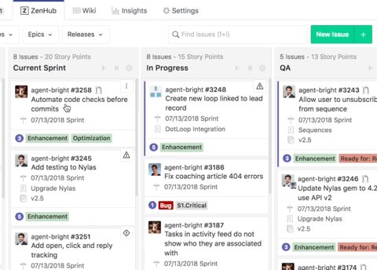
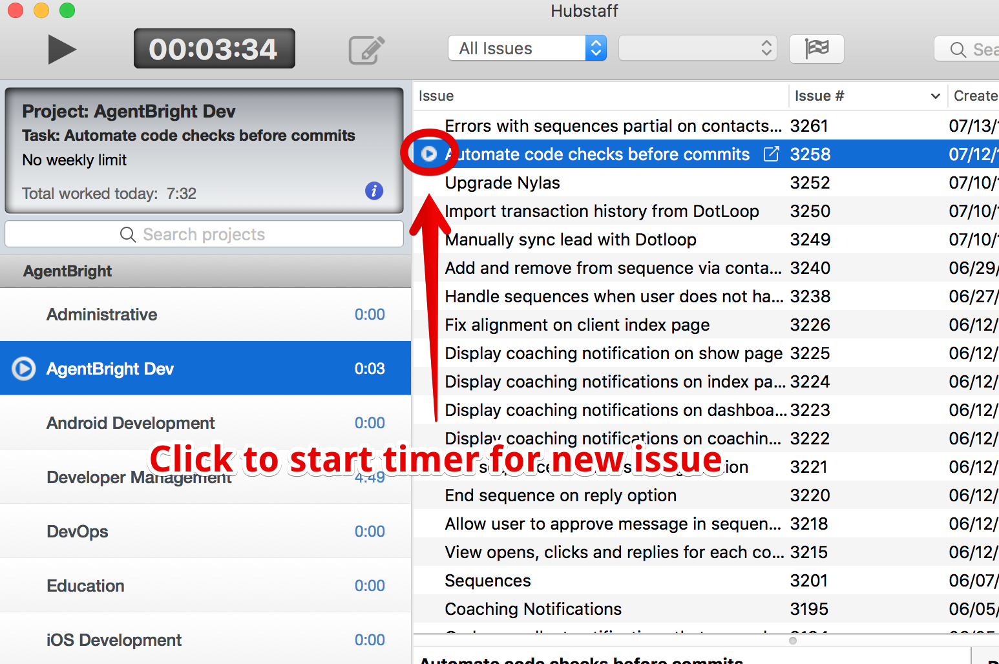

# GitHub and Zenhub

We use [GitHub](https://www.github.com) to manage all of our pending work.

## Zenhub

We use [Zenhub](https://www.zenhub.com) as an add-on to GitHub in order to add additional metadata to issues, and to make use of a kanban-style board.

### Zenhub browser extensions

Zenhub has a Chrome extension and a Firefox extension for displaying their board and extra data right on the GitHub site.

You can download the extensions here: [https://www.zenhub.com/extension](https://www.zenhub.com/extension)

## Starting an issue

Refer to the **ZenHub** board to see what issues you have been assigned.

The issues are listing in priority. Choose the topmost issue from the **Current Sprint** list.

When you begin work, move the issue to the **In Progress** list.

In Hubstaff, make sure that the issue you are working on is selected.

