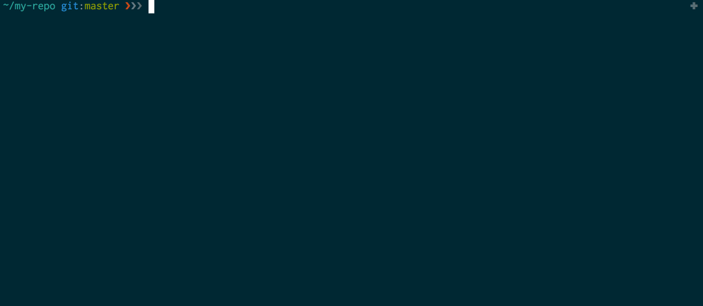

# Overcommit

## Overview



[Overcommit ](https://github.com/brigade/overcommit)is a gem that uses git hooks to analyze your code and your commit message when you make a commit.

When you make a commit, it checks for styling, best practices and security risks by running a number of linters and analyzers.

If the checks all pass, the commit proceeds. If the checks fail, the commit is interrupted.

## Best practice

In order to avoid being surprised with a large number of fixes to have to make at the end of your issue in order to get it to pass, use these two best practices:

### Small commits

We prefer making more smaller commits as we go, and then squashing commits at the end of an issue.

Writing clear, descriptive commit messages are very important to us, especially as a remote company. Making small commits ensures that you are documenting your work as you go, instead of trying to recall everything at the end.

### Code linters

One way to get instant feedback on code is the use of live code linters. We have used [SublimeLinter](http://www.sublimelinter.com/en/stable/) with [SublimeLinter-rubocop](https://github.com/SublimeLinter/SublimeLinter-rubocop) for viewing rubocop violations live in Sublime Text, as well as Guard for Test Driven Development.


You might run into some issues if you use a Git GUI to make commits, because some of them do not support git hooks, and fail to show you the full message contents from a failing check.


## Pre-commit checks

When you run `git commit`, [Overcommit](https://github.com/brigade/overcommit) will run the following pre-commit checks:

* Check Gemfile dependencies
* Check for local paths in Gemfile
* Check for merge conflicts
* Check that the database schema is up to date
* Check for trailing whitespace
* Check for any "FIXME" comments
* Analyze YAML syntax 
* Analyze Javascript using **ESlint**
* Analyze SCSS using **scss-lint**
* Analyze Ruby using **rubocop**

Here's what it looks like when they all pass:

```text
$ git commit
Running pre-commit hooks
Check YAML syntax........................................[YamlSyntax] OK
Check for local paths in Gemfile................[LocalPathsInGemfile] OK
Check if database schema is up to date..........[RailsSchemaUpToDate] OK
Check for trailing whitespace....................[TrailingWhitespace] OK
Check for "token" strings.....................................[FixMe] OK
Check Gemfile dependencies..............................[BundleCheck] OK
Analyze with scss-lint.....................................[ScssLint] OK
Analyze with ESlint..........................................[ESLint] OK
Analyze with RuboCop........................................[RuboCop] OK

✓ All pre-commit hooks passed
```

If any of the checks fail, your commit will be interrupted.

## Commit message checks

Overcommit also checks for commit message formatting. Good, clear commit messages are important. Here is the styling we enforce for commit messages:

* The subject message \(first line\) must be in this format: `#<issue number> - <Overview of commit>`
* The subject message line must not exceed 60 characters
* The subject message must start with a capital letter
* The subject message must not end in a period
* There must be an empty line after the subject message
* No line in the body may exceed 72 characters

Once you have entered your commit message, overcommit will run commit-msg hooks:

```text
Running commit-msg hooks
Check commit message matches expected pattern.........[MessageFormat] OK
Run CapitalizedSubjectMessage.............[CapitalizedSubjectMessage] OK
Check text width..........................................[TextWidth] OK
Check subject line................................[SingleLineSubject] OK
Check for trailing periods in subject................[TrailingPeriod] OK

✓ All commit-msg hooks passed
```

## Run overcommit manually

To run overcommit without actually committing anything:

```text
$ overcommit --run
```


This will run the checks across the entire repository, not just the files you've made changes to.


## Overriding overcommit

There will be times when you need to make a commit despite an overcommit check failure. You might be fixing code that has an issue that is out of scope. Or you might want to commit work-in-progress changes.

You can skip overcommit by running:

```text
$ git commit --no-verify
```

If you are rebasing, or running another script with git commands, you can also prepend `OVERCOMMIT_DISABLE=1` to your command to disable overcommit:

```text
$ OVERCOMMIT_DISABLE=1 git rebase -i HEAD~3
```


